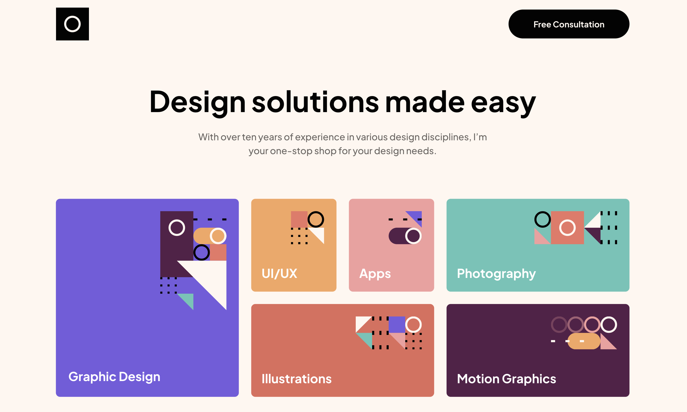
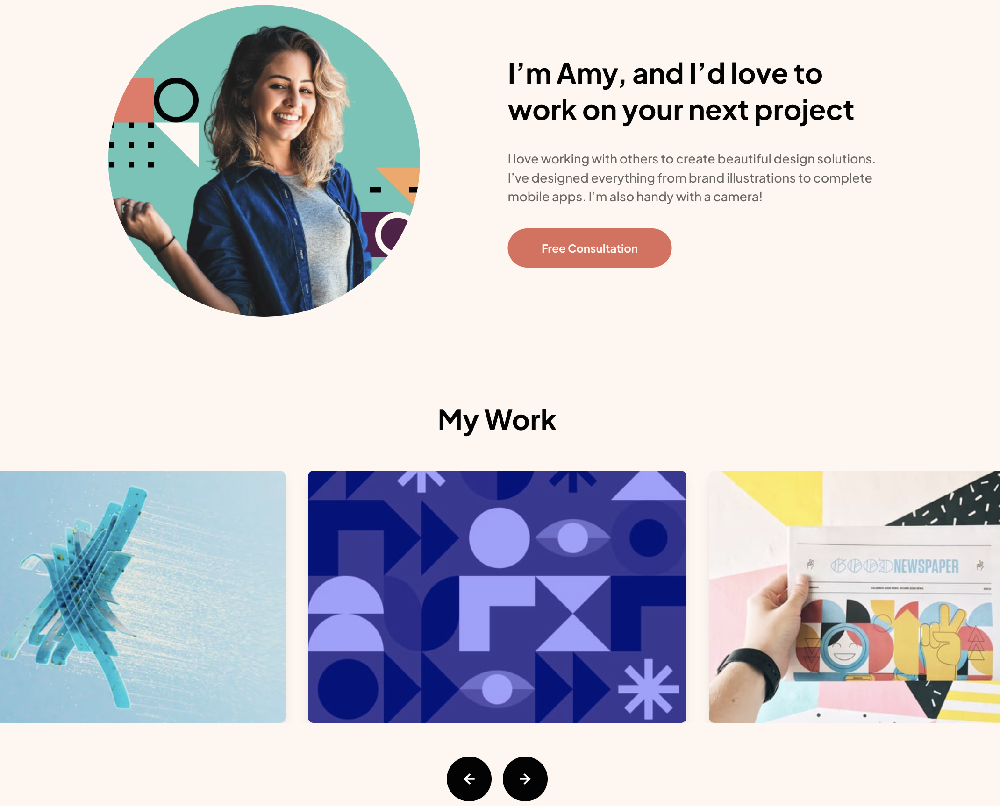
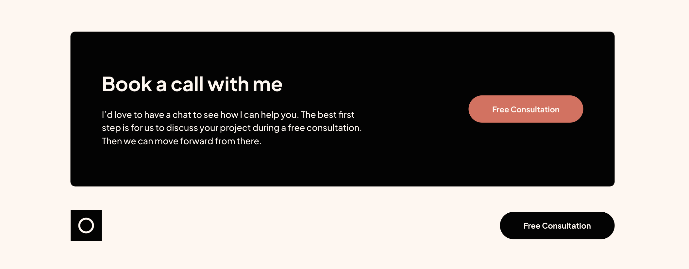

# Single Page Design Portfolio

## Table of contents

- [Overview](#overview)
  - [Screenshot](#screenshot)
  - [Links](#links)
- [My process](#my-process)
  - [Built with](#built-with)
- [Author](#author)

## Overview

### Screenshot

### Links

- Solution URL: [Solution URL](https://github.com/kisu-seo/single_page_design_portfolio)
- Live Site URL: [Live URL](https://kisu-seo.github.io/single_page_design_portfolio/)

## My process

### Built with

- **React 19** — Component-based architecture with clean separation of concerns. The main UI is modularized into `CardView` (card visualization), `CardForm` (user inputs), and `CompleteView` (success message) to ensure high reusability and structured data flow.
- **React State Management (useState)** — Integrates unified states (`formData`, `errors`, `isSubmitted`) in the top-level `App` component, implementing solid one-way data binding to synchronize input entries and the card plate illustration in real time.
- **Vite 8** — Utilized as the ultra-fast frontend build tool and local development server for instant Hot Module Replacement (HMR).
- **Tailwind CSS v4** — Customizing utility classes such as `@theme` and `@utility` presets (e.g. `border-gradient-2-active` for the active input gradient outline) directly inside `src/index.css`, making stylesheets modular and eliminating the need for legacy configurations.
- **Semantic HTML5 & Accessibility (A11y)** — Built with accessibility first. Links `<input>` items and `<label>` elements via unique IDs, manages real-time screen reader warnings using `role="alert"` alongside `aria-invalid`/`aria-describedby` mappings, and optimizes mobile text fields using `inputMode="numeric"` keys.
- **Responsive Layout & Absolute Positioning** — Employs custom absolute positioning coordinates and responsive layout controls (`flex-col` on mobile viewports vs `flex-row` and `1440px` breakpoint boundaries on desktop viewports) to ensure card assets align seamlessly with the background artwork.

## Author

- Website - [Kisu Seo](https://github.com/kisu-seo)
- Frontend Mentor - [@kisu-seo](https://www.frontendmentor.io/profile/kisu-seo)
